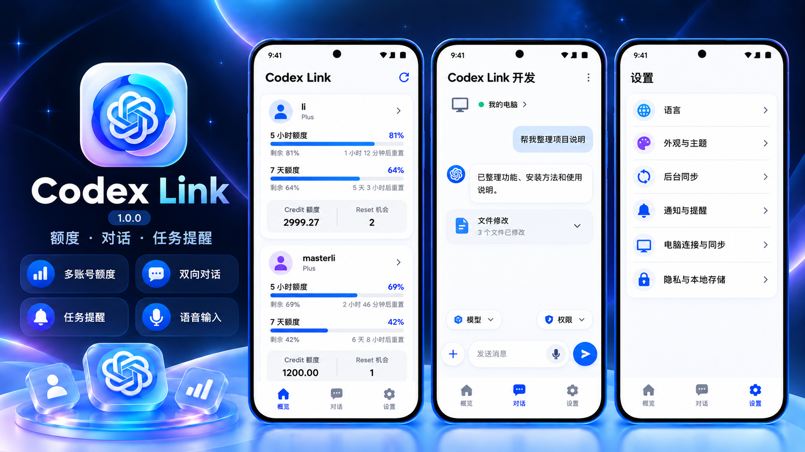

# Codex Link

**Codex 随行** — 在手机上连接 Codex、查看额度并继续对话。

**作者：masterli0312 · 开发协助：ChatGPT**

在 Android 手机上查看多个 ChatGPT / Codex 账号的额度，并通过配对电脑接收任务提醒、阅读和继续 Codex 对话。支持简体中文与英文。

[下载 1.0.1 APK](https://github.com/masterli0312/Codex-Link/releases/download/apk-1.0.1-debug/Codex-Link-v1.0.1-debug.apk) · [发布说明](https://github.com/masterli0312/Codex-Link/releases/tag/apk-1.0.1-debug) · [全部版本](https://github.com/masterli0312/Codex-Link/releases)

> 项目由 Codex Usage 更名为 **Codex Link**。当前源码与本轮手机安装版本为 **1.0.2**（versionCode **36**），包含对话打开与引导修复、按需同步、附件下载和界面统一。公开下载页目前仍为 **1.0.1**；本次更新源码，不创建新的 Release。

> Android **8.0+**。已配对的用户升级后还需从 App 重新分享电脑安装包，在电脑运行 `setup.cmd` 并按提示重启 Codex。只更新 APK 不会更新电脑组件。

**电脑任务提醒和远程对话需要首次电脑配对。** 仅安装 App 或登录 ChatGPT 不能获取电脑任务事件。

**中国大陆用户接收任务提醒本身不需要开启 VPN，也不依赖 Google Play Services。** 前提是手机和电脑都能访问所选通知服务。账号登录、额度刷新、Reset、自动激活及 Cloud 仍需能访问 OpenAI；请区分这两种网络需求。



*Codex Link 1.0.0 的 AI 功能示意图，展示概览、对话与设置，非实机截图；账号、数值及布局仅作示意，以实际 App 为准。*

## 主要功能

底部导航为 **概览 / 对话 / 设置**。

| 功能 | 可以做什么 |
| --- | --- |
| 多账号额度 | 查看服务端返回的 5 小时、7 天额度、Credit 额度、Reset 机会和重置时间。 |
| 自动刷新 | 打开或返回 App 时自动刷新；支持手动刷新和后台定期同步。 |
| 自动激活 | 每个账号独立选择，在 5 小时窗口到期后尝试发送小请求激活新窗口。 |
| 额度提醒 | 低额度提醒、5 小时及 7 天重置前约 5 分钟提醒、Reset 机会增加提醒。 |
| Credit 记录 | 查看余额变化、每小时和近 24 小时汇总，减少逐条记录干扰。 |
| 任务通知 | 电脑任务结束后提醒，可选显示对话名称与最后回复预览，点击进入对话。 |
| 双向对话 | 选择需要同步的电脑对话，手机新建或继续、停止生成、执行中引导；未选中的电脑对话仍可接收完成提醒。 |
| 对话管理 | 搜索、左滑置顶/重命名/归档、归档恢复，查看与加载较早历史。 |
| 对话输入 | 模型与可用思考强度、权限、计划和目标模式、支持的插件、图片与文件、语音转文字。 |
| 执行过程 | 简洁工具条目，回复上方显示已处理时间；完成后通过用时条目展开过程，正文和过程保留宽松间距。 |
| 远程文件与问题 | 读取并下载电脑生成的 PDF、Word、PPT 等文件；PDF 内置预览，其他格式交给手机已安装的查看应用。支持远程问题选项弹窗。 |
| Cloud（实验性） | 在手机管理官方云环境、准备项目和进入云对话，详细验证范围见下文。 |
| 日常体验 | 浅色/深色、Material You 动态颜色、桌面小组件与本地数据清理。 |

### 额度数据的含义

- **5 小时 / 7 天额度**：Provider 返回的使用比例和重置时间，不代表固定 Token 总量。
- **Credit 额度**：服务端返回的 Credit 数值，保留其精度；与官网取整显示可能不同，不能当作美元余额。
- **Reset 机会**：仅展示接口实际返回的可用次数；使用前确认，操作后重新读取真实额度。
- **Credit 变化记录**：两次成功读取之间的差值。每小时统计按观测时刻归入，无法精确还原两次读取之间每一笔消耗，也不是官方账单。

接口未提供的字段显示不可用。周额度耗尽时，隐藏不可用的 5 小时百分比及倒计时，并暂停该账号的自动激活和 5 小时提醒。当前版本**不估算 Weekly Token 或美元消耗**。

## 安装与升级

1. 下载 [Codex-Link-v1.0.1-debug.apk](https://github.com/masterli0312/Codex-Link/releases/download/apk-1.0.1-debug/Codex-Link-v1.0.1-debug.apk)。
2. 在 Android 8.0 或更新系统打开 APK，按系统提示允许安装。
3. 首次打开添加自己的账号；需要提醒时允许通知和后台运行。
4. 已使用电脑同步的用户：更新手机后，重新分享电脑安装 ZIP，在原电脑运行 `setup.cmd`，按安装器提示重启 Codex。

公开下载的 1.0.1 包名为 `com.codex.quota.debug`，内部版本号 **35**；当前源码构建为 **1.0.2 / 36**。覆盖升级需要相同包名与签名。**1.0.1 的 GitHub 构建与 1.0.0 公开 APK 签名不同，不能直接覆盖。保留数据升级需要原签名密钥构建；卸载会清除手机本地账号、配对和设置。** 本轮本地 1.0.2 已成功覆盖安装，但这不代表任意来源的 APK 签名都相同。

发布页同时提供 SHA256 校验文件。此版本不是正式签名生产包。

## 添加账号与自动激活

在 App 添加并授权自己的 ChatGPT / Codex 账号，按界面流程完成登录。账号可设置简短昵称；各账号的凭据、额度、历史和提醒独立保存。OAuth 凭据可续期时自动续期，授权失效则重新登录。

自动激活只在 **账号详情** 按账号开启，不再提供主动激活按钮。它会发送一个真实的小型 Codex 请求，可能消耗少量额度或 Credit；不想产生请求的账号请关闭。

**自动激活由手机执行，与电脑开关机无关。手机关闭节点后若无法访问 OpenAI，就不能激活；恢复可访问的网络后才可继续。** Android 省电与后台调度可能延迟执行，恢复网络不等于立即完成。最终结果以服务端新额度和重置时间为准；结果不确定的请求不会盲目重复发送。

## 电脑配对、任务提醒与远程对话

### 首次配置

1. 进入 **设置 → 电脑连接与同步**，开启任务完成提醒并允许系统通知。
2. 需要查看回复和续聊时，开启正文同步、手机继续 Codex 对话；通知预览可单独选择。
3. 点击 **分享电脑安装包**，将私人 ZIP 传到自己的 Windows 电脑，解压并运行 **`setup.cmd`**。
4. 按安装器提示完成配置、检查配对测试通知并重启 Codex。
5. 在 **对话 → 同步对话** 中选择需要的电脑对话；只同步选中的内容，不自动导入所有历史。也可选择电脑创建新对话。任务完成提醒继续覆盖所有电脑对话。

电脑需安装 Codex 和 Node.js：基础通知组件支持 **Node.js 18+**；双端共享对话需 **Node.js 22+**，建议安装当前 LTS。安装器会优先查找现有运行时。安装后组件在后台运行，不需要一直打开终端。

**同一个桌面对话的双端续聊需启用共享连接并从配置后的入口启动 Codex。** 兼容性取决于 Codex 桌面版本；启用与停用见 [详细使用说明](docs/task-notifications.md#双端共享连接)。独立连接模式不能写入被桌面独占的线程。同一对话可在两端使用，但一轮任务只启动一次；执行中使用补充要求或排队消息。

### 使用与连接条件

- 手机任务使用**配对电脑上的 Codex 认证与 Provider 配置**，不会随手机概览中的额度账号切换。
- 电脑执行任务时必须开机、用户已登录且能访问模型服务和通知服务；手机需要能访问通知服务。
- 手机可选择电脑返回的模型、思考强度与权限。选项以实际支持为准，不强行添加模型不支持的强度。
- 一次草稿最多选择 10 个图片/文件，输入框展示缩略图，点击预览，右上角 X 删除。附件另有传输大小限制。电脑对话中可读取的图片也可加密同步到手机。
- 执行中发送的消息先保留为待选择条目，可编辑、取消或改为引导；只有确认引导已送达才进入对话，不会在当前任务结束后自动发送未选择的内容。引导确认使用独立的轻量回执，避免大段对话同步阻塞；实际速度取决于网络和电脑状态。
- 左滑对话露出置顶、重命名和归档操作。模型列表来自电脑实际返回的目录；插件管理可选择输入菜单中显示的插件。
- 电脑提出可远程回答的问题时，手机显示选项弹窗；答复只提交给匹配的请求和当前轮次，不自动选择权限。
- 电脑生成的文件可通过回复中的文件卡片下载；PDF 在 App 内预览，Word/PPT 等使用系统打开，需要手机安装相应查看应用。
- 语音转文字进入可编辑草稿，由用户确认发送。系统服务不可用时，可下载约 **240 MB 的 SenseVoice INT8 离线模型**；模型不包含在 APK 中。离线路径不保存或上传录音，准确率仍受发音与环境影响。
- 回复生成时隐藏复制图标，完成后显示；上下文与额度状态优先使用当前对话缓存，再后台更新。
- 置顶只影响当前手机；重命名和归档通过电脑接口执行。历史与大图受缓存和传输上限约束，不保证完整保留任意长度对话。
- 通知卡片使用与桌面一致的白底蓝紫标志；标准 Android 状态栏使用相应单色轮廓。部分系统会缓存旧应用图案，例如 vivo 更新后仍显示旧图时，可重启手机一次，无需清除 App 数据。

**持续实时对话建议使用独立 HTTPS ntfy 中继。** 默认公共 `ntfy.sh` 有每日发送额度、频率和附件有效期限制；达到限额时，连接在线也可能无法传递回复。App 支持兼容的自托管通知服务，配置和迁移见 [中继说明](docs/task-notifications.md#持续对话建议使用独立中继)。本仓库不公开私人服务器、配对密钥或安装 ZIP。

任务通知表示本轮已结束，不保证任务成功。系统省电、网络、电脑离线或服务限额可能延迟或阻断通知；不承诺任何网络下永久在线或固定低于 1 秒。

## 官方 Cloud（实验性）

在 **对话 → Cloud → 管理云环境** 中选择账号和已授权的 GitHub 项目，确认模型及思考强度，自动准备、查看结果、发布并使用环境。脚本等高级配置默认折叠，准备对话支持自然语言补充。

Cloud 由手机直接访问官方服务，不需要配对电脑保持开机；GitHub 仓库是项目代码来源，云执行环境由 OpenAI 提供。首次 GitHub 授权需在官方页面完成。

Cloud 使用统一对话界面，已接入重命名、归档、已归档列表与恢复，并可加载更早消息；手机保留的历史仍有容量上限。

**当前真实验证范围包括目录、模型读取和环境准备；完整新建、发布及普通云对话续聊仍未完成全流程实机验收。** Cloud 附件、后台完成通知及本地对话无损迁移尚未接入。详见 [Cloud 范围与限制](docs/cloud-environments.md)。

## 设置与后台运行

| 设置入口 | 内容 |
| --- | --- |
| 语言 | 跟随系统、简体中文、English。 |
| 外观与主题 | 浅色、深色、跟随系统、动态颜色。 |
| 后台同步 | 开关及 15 分钟 / 30 分钟 / 1 小时 / 3 小时频率。 |
| 通知与提醒 | 低额度、5 小时及 7 天重置前提醒、Reset 机会增加提醒。 |
| 电脑连接与同步 | 任务提醒、正文与对话同步、电脑配对、后台接收。 |
| 隐私与本地存储 | 加密说明、清除本地数据及密钥。 |

低额度默认阈值为剩余 25%、10%、5%，按账号和窗口去重。重置前提醒目标为约 5 分钟前，Android 调度可能延迟，已过期提醒会跳过。Reset 机会提醒以真实次数增加为依据，不估算恢复时间。

Android 13+ 需要通知权限；声音和震动由系统通知渠道管理。若锁屏后收不到提醒，请检查系统的后台运行、自动启动和电池限制。强行停止 App 会中断接收，重新打开后恢复。

## 隐私与安全

- 登录凭据保存在手机的加密存储中，由 Android Keystore 管理密钥；敏感文件和配对数据排除系统备份。
- 额度、认证与 Cloud 请求通过 HTTPS 直接访问 OpenAI，不经通知中继。
- 可选对话正文、附件与远程控制消息使用配对密钥加密；中继不接收 OpenAI 登录凭据，但能观察连接地址、时间、密文大小和必要事件元数据。
- 私人安装 ZIP 包含配对信息；**不要公开分享、提交 GitHub 或贴到 Issue**。随机主题不等于服务端访问控制，自托管应限制允许访问的主题。
- 本项目不集成广告、分析或用户追踪 SDK。清除本地数据会移除手机账号与密钥，电脑组件需另外停用。

详细边界和卸载方法见 [电脑连接指南](docs/task-notifications.md)。

## 1.0.2 更新摘要（当前源码）

- 修复打开对话出现空白、旧任务内容覆盖新回复、首次加载一直等待的问题；校验真实线程与轮次，保留已确认的较完整内容。
- 引导请求清除错误继承的监听参数，支持执行中图片附件；确认回执独立传输，不受大快照发送和下载阻塞，不确定结果保留草稿。
- 电脑对话改为按需同步；任务完成通知仍覆盖所有电脑对话。左滑提供置顶、重命名、归档，并修复归档确认和恢复。
- 统一概览、详情、设置、电脑对话及 Cloud 的配色和菜单；正文与过程增加行距和留白，刷新状态放在卡片右下角更新时间位置。
- 白底蓝紫桌面图标与通知卡片统一；vivo 的旧系统图标缓存已在重启后实机确认清除。
- 增加远程问题弹窗、生成文件下载与 PDF 预览、插件管理，草稿最多可选择 10 个附件。
- Cloud 接入更早历史分页、重命名、归档列表与恢复，保留实验性范围说明。

推送前检查：360 项 Android 单元测试、200 项 Node.js 电脑组件测试，以及 Windows 安装器与并发配置写入检查通过；Debug 构建与 Android lint 通过（无错误，292 项警告）。

[1.0.2 更新说明](RELEASE_NOTES_1.0.2_LINK.md) · [界面及验证记录](docs/ui-1.0.2.md)。本次只推送源码与文档，公开 APK 下载仍为 1.0.1。

## 1.0.1 更新摘要

- 修复电脑与 Cloud 最新消息同步、正文与复制布局，以及附件路径展示。
- 统一浅色背景、输入框和简洁工具条目。
- 支持排队消息编辑、取消与立即引导，确认送达后进入正文上方；完成后显示用时与完整回答。
- Release 自动发布版本匹配的 APK 和校验文件。

[1.0.1 完整发布说明](RELEASE_NOTES_1.0.1_LINK.md)。本次未进行手机安装实测，Cloud 完整附件上传仍未接入。

## 1.0.0 历史更新摘要

- 新项目首版：应用显示 Codex Link 1.0.0，通知卡片使用桌面图标，状态栏使用对应的单色轮廓。

- 新增独立对话入口、双向续聊、环境选择、模型与权限、计划/目标模式、图片文件及语音输入。
- 任务通知可显示名称和回复；设置、账号详情与 Credit 变化记录重新整理。
- 修复旧通知和历史任务覆盖最新正文、重复跳回旧对话、回复闪动、图片并发失败与错误连接状态。
- 改善缓存、实时接收和页面切换；移除常驻加载线及正文左侧加载圈，工具过程改为紧凑条目。
- 按账号自动激活，周额度耗尽保护；增加 7 天重置前提醒及 Reset 机会增加提醒。
- 增加实验性官方 Cloud 原生接入。

1.0.1 发布检查：310 项 Android 单元测试、168 项 Node.js 电脑组件测试通过；Windows 安装器、并发配置写入检查通过，Debug 构建和 Android lint 通过。相关双向对话、流式展示及安装已有实机验证；这些检查不代表所有网络、设备或 Cloud 流程均已验收。

[完整发布说明](RELEASE_NOTES.md) · [历史更新](docs/changelog.md)

## 从源码构建

需要 JDK 17 或 21、Android SDK 35，可在 Android Studio 打开。

```bash
git clone https://github.com/masterli0312/Codex-Link.git
cd Codex-Link
./gradlew testDebugUnitTest lintDebug assembleDebug
```

Windows 使用 `gradlew.bat`。输出为 `app/build/outputs/apk/debug/app-debug.apk`。语音 SDK 构建时按固定来源与校验值获取，模型权重由手机按需下载。

Windows 电脑组件检查：

```powershell
$taskTests = @(Get-ChildItem tools/task-notifications -Filter '*.test.cjs' | ForEach-Object { $_.FullName })
node --test @taskTests
powershell -NoProfile -File tools/task-notifications/install-notify.test.ps1
pwsh -NoProfile -File tools/task-notifications/settings-file.test.ps1
```

GitHub Actions 对 `main` 和 Pull Request 执行 Android 与 Windows 检查。`v*` 标签另触发正式签名构建，需配置签名 Secrets；`apk-*-debug` 标签在 Android 与 Windows 检查通过后自动发布测试 APK 和 SHA256，核对标签、内部版本和有效签名；当前标签为 `apk-1.0.1-debug`。正式签名流程尚未验证。

正式构建可在被 Git 忽略的 `signing.properties` 中配置 `storeFile`、`storePassword`、`keyAlias`、`keyPassword`，或使用 `ANDROID_KEYSTORE_FILE`、`ANDROID_KEYSTORE_PASSWORD`、`ANDROID_KEY_ALIAS`、`ANDROID_KEY_PASSWORD` 环境变量，运行 `assembleRelease`。不要提交密钥库或口令。

### 项目结构

```text
app/src/main/java/com/codex/quota/
├── auth/                  登录与令牌续期
├── data/                  数据库、偏好、额度与 Cloud 数据源
├── domain/                账号、额度与 Credit 统计
├── notifications/         额度提醒、电脑连接与加密对话
├── security/              Keystore 与凭据存储
├── ui/                    Compose 页面与主题
├── widget/                桌面小组件
└── worker/                后台刷新、自动激活与重置提醒
app/src/main/assets/task-notifications/  Windows 配对与对话组件
tools/task-notifications/                电脑组件测试
docs/                                   使用说明与依赖许可
```

主要技术：Kotlin、Jetpack Compose / Material 3、Room、DataStore、WorkManager、OkHttp、Markwon、sherpa-onnx 和 Node.js。

## English

Author: **masterli0312**. Development assistance: **ChatGPT**.

Codex Link (formerly Codex Usage) is an Android 8.0+ app for multiple ChatGPT/Codex accounts. It displays provider-reported 5-hour and weekly limits, resets, Credit and Reset opportunities. It refreshes on opening, supports optional per-account automatic activation, reminders, and locally observed hourly Credit changes. It does not estimate weekly Token capacity or dollar balances.

**Task notifications and remote conversations require one-time Windows pairing.** Export a private setup ZIP from Settings → Computer connection and sync, extract it on your computer, run `setup.cmd`, and restart Codex as instructed. Enable encrypted content sync and remote conversation controls as needed. Existing users must also update the Windows component; upgrading the APK alone is insufficient. Basic notifications require Node.js 18+; shared desktop/phone conversations require Node.js 22+ and a compatible Codex Desktop version.

The app supports two-way text conversations, available models and reasoning levels, permissions, plan/goal modes, supported tools, attachments and editable speech-to-text. An optional SenseVoice INT8 model (~240 MB) performs offline transcription. Local pinning is phone-only. Conversations use the paired computer's authentication, independent of the phone's quota accounts. Continuous streaming is best served by a private HTTPS ntfy relay; the public service has rate, daily and attachment limits.

**Task notifications do not inherently require a VPN or Google Play Services, including in mainland China, provided the notification service is reachable.** Authentication, quota, automatic activation and Cloud require access to OpenAI. Activation runs on the phone and cannot proceed while OpenAI is unreachable; it can continue when access is restored. Android background restrictions and network conditions can delay delivery.

Current source is **1.0.2 / versionCode 36**; the public [debug APK download](https://github.com/masterli0312/Codex-Link/releases/tag/apk-1.0.1-debug) remains **1.0.1 / 35**. This update publishes source and documentation without creating a new Release. In-place upgrades require matching package and signing certificates; the public 1.0.0 and GitHub-built 1.0.1 use different certificates.

Version 1.0.2 adds selective computer conversation sync, swipe actions, remote question dialogs, generated-file downloads, PDF preview and up to 10 draft attachments. Steer receipts bypass conversation snapshot transfer; real latency still depends on connectivity. Notification cards use the launcher artwork; OEMs such as vivo may need one phone reboot to discard cached old icons.

Cloud integration is **experimental**: directory/model reads and environment preparation have been verified, but the full create/publish/normal-conversation flow has not completed device acceptance. Earlier-message loading, rename, archive and restore are implemented with bounded history. Cloud attachments and background completion notifications remain unavailable. Credentials stay in Keystore-backed local storage; optional conversation contents and remote messages are encrypted using pairing keys. Never publish your pairing ZIP.

## 许可与声明

基于 [boudywho/codex-quota-android](https://github.com/boudywho/codex-quota-android)，按 [MIT License](LICENSE) 分发。与 OpenAI 没有隶属、授权或背书关系；相关商标归权利人所有。

对话与远程实现参考 [slopus/happy](https://github.com/slopus/happy)；Cloud 接口调查参考 [dvcrn/mcp-server-codex-cloud](https://github.com/dvcrn/mcp-server-codex-cloud)。这些参考不代表本项目获得官方兼容性保证。

依赖许可：[Markwon](docs/licenses/Markwon-LICENSE.txt)、[语音 SDK 与 SenseVoice 模型说明](docs/licenses/Voice-NOTICE.md)、[通知单色图标 CC0](docs/licenses/Simple-Icons-CC0.txt)。SenseVoice 权重适用其独立模型许可，并非 SDK 的 Apache 许可；模型按需下载，来源及校验值见语音说明。
